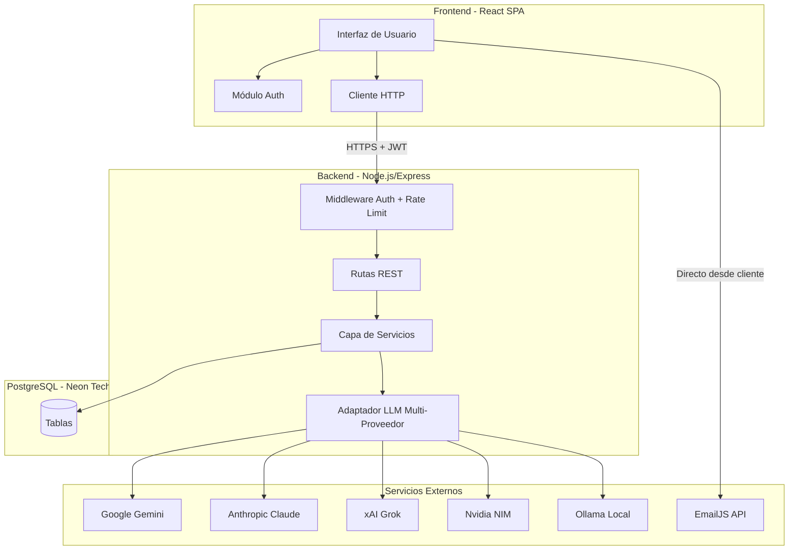
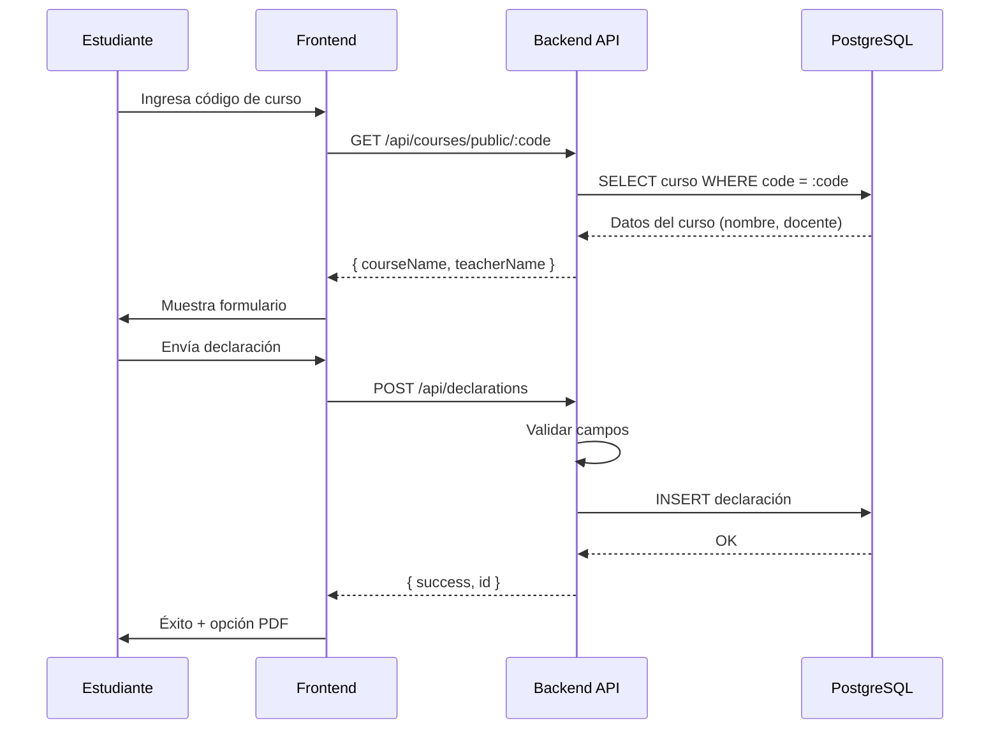
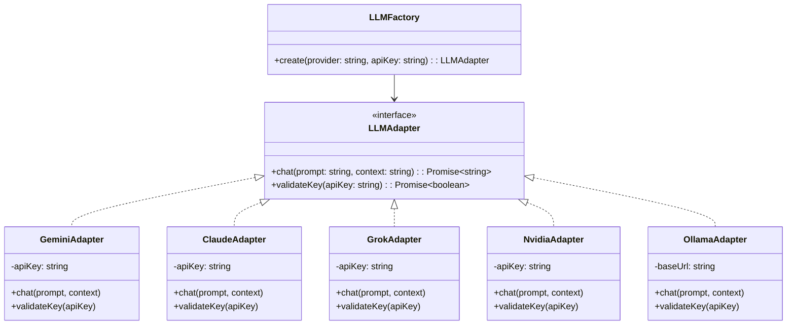

# Documento de Diseño Técnico — Evolución de la Plataforma IATA

## Overview

La evolución de la plataforma IATA transforma una aplicación SPA de navegador sin persistencia en un sistema cliente-servidor completo. La arquitectura se divide en tres capas:

1. **Frontend** — Aplicación React (SPA) que reemplaza el renderizado manual con DOM imperativo
2. **Backend** — API REST con Node.js/Express, autenticación JWT y lógica de negocio
3. **Base de datos** — PostgreSQL (Neon Tech) con esquema relacional multi-institución

### Decisiones de Tecnología Clave

| Decisión | Elección | Justificación |
|----------|----------|---------------|
| Frontend | React + Vite | La complejidad del UI (dashboard, chat IA, formularios dinámicos, paginación) justifica un framework reactivo. Vite elimina la complejidad de webpack. |
| Backend | Node.js + Express | Mismo lenguaje que el frontend, ecosistema maduro para JWT y middleware, equipo ya familiarizado con JS. |
| ORM/Query | Drizzle ORM | Type-safe, ligero, genera migraciones SQL, sin magia oculta como Prisma. |
| Base de datos | PostgreSQL (Neon Tech) | Serverless Postgres, escalado automático, branching para desarrollo. |
| Autenticación | JWT + bcrypt | Sin dependencia de servicio externo, control total sobre flujo de sesión. |
| Integración IA | Adaptador multi-proveedor | Patrón Strategy para soportar Gemini, Claude, Grok, Nvidia, Ollama sin acoplamiento. |
| PDF | jsPDF (cliente) | Mantiene compatibilidad con el flujo actual, sin carga al servidor. |
| Email | EmailJS (cliente) | Mantiene compatibilidad existente; las credenciales son por-curso. |

---

## Architecture

### Diagrama de Alto Nivel



### Flujo de Solicitudes



### Estructura de Carpetas del Proyecto

```
iata-app/
├── client/                    # Frontend React
│   ├── src/
│   │   ├── components/        # Componentes reutilizables
│   │   ├── pages/             # Vistas principales
│   │   ├── hooks/             # Custom hooks (useAuth, useCourses)
│   │   ├── services/          # Clientes API
│   │   ├── context/           # React Context (Auth, Theme)
│   │   └── utils/             # Validación, formateo, PDF
│   ├── public/
│   └── vite.config.js
├── server/                    # Backend Express
│   ├── src/
│   │   ├── routes/            # Definición de rutas
│   │   ├── middleware/        # Auth, rate-limit, validation
│   │   ├── services/          # Lógica de negocio
│   │   ├── models/            # Esquema Drizzle ORM
│   │   ├── llm/               # Adaptadores de proveedores IA
│   │   └── utils/             # Helpers (crypto, codes, etc.)
│   ├── drizzle/               # Migraciones SQL
│   └── package.json
├── shared/                    # Tipos y constantes compartidas
│   └── validation.js          # Reglas de validación reutilizables
└── package.json               # Workspace root
```

---

## Components and Interfaces

### Backend — Capa de Middleware

```javascript
// Middleware de autenticación JWT
function authMiddleware(req, res, next) {
  // Extrae token de header Authorization: Bearer <token>
  // Verifica firma y expiración
  // Adjunta req.teacher = { id, email, institutionId, role }
  // Retorna 401 si falla
}

// Middleware de rate limiting
function rateLimiter(config) {
  // Limita endpoints públicos: 60 req/min por IP
  // Retorna 429 si se excede
}

// Middleware de validación
function validate(schema) {
  // Valida body/params/query contra esquema
  // Retorna 400 con detalle de errores
}
```

### Backend — Rutas Principales

| Método | Ruta | Autenticación | Descripción |
|--------|------|---------------|-------------|
| POST | `/api/auth/register` | No | Registro de docente |
| POST | `/api/auth/login` | No | Inicio de sesión |
| POST | `/api/auth/forgot-password` | No | Solicitar restablecimiento |
| POST | `/api/auth/reset-password` | No | Restablecer contraseña |
| GET | `/api/courses` | JWT | Listar cursos del docente |
| POST | `/api/courses` | JWT | Crear curso |
| PUT | `/api/courses/:id` | JWT | Editar curso |
| DELETE | `/api/courses/:id` | JWT | Eliminar curso |
| GET | `/api/courses/public/:code` | No | Obtener datos públicos del curso |
| POST | `/api/declarations` | No | Enviar declaración (estudiante) |
| GET | `/api/declarations` | JWT | Listar declaraciones (paginadas) |
| GET | `/api/declarations/:id` | JWT | Detalle de declaración |
| GET | `/api/declarations/export` | JWT | Exportar CSV |
| GET | `/api/dashboard/stats` | JWT | Estadísticas del dashboard |
| POST | `/api/ai/chat` | JWT | Consulta al asistente IA |
| PUT | `/api/ai/config` | JWT | Configurar proveedor IA |
| GET | `/api/ai/config` | JWT | Obtener config IA actual |
| POST | `/api/institutions` | JWT | Crear institución |
| GET | `/api/institutions/members` | JWT + Admin | Listar miembros |
| POST | `/api/institutions/invite` | JWT + Admin | Generar código de invitación |
| POST | `/api/institutions/join` | JWT | Unirse con código |
| DELETE | `/api/institutions/members/:id` | JWT + Admin | Revocar membresía |

### Backend — Capa de Servicios

```javascript
// AuthService
class AuthService {
  register(email, password, institutionOption) → { teacher, token }
  login(email, password) → { teacher, token }
  requestPasswordReset(email) → void
  resetPassword(token, newPassword) → void
  verifyToken(token) → teacherPayload
}

// CourseService
class CourseService {
  create(teacherId, institutionId, data) → course
  update(teacherId, courseId, data) → course
  delete(teacherId, courseId) → void
  findByTeacher(teacherId) → courses[]
  findByCode(code) → publicCourseInfo | null
  generateUniqueCode() → string (6 chars)
}

// DeclarationService
class DeclarationService {
  create(courseCode, data) → declaration
  findByCourse(teacherId, courseId, filters, pagination) → { data, total, page }
  findByStudent(teacherId, query) → declarations[]
  exportCSV(teacherId, courseId, filters) → csvString
  getById(teacherId, declarationId) → declaration | null
}

// DashboardService
class DashboardService {
  getStats(teacherId, courseId?) → {
    totalDeclarations, usedAI, notUsedAI,
    topTools[], declarationsPerCourse[],
    progressByCourse[]
  }
}

// AIService
class AIService {
  configure(teacherId, provider, apiKey) → void
  chat(teacherId, query, courseId?) → response
  summarize(teacherId, courseId) → summary
  getConfig(teacherId) → { provider, hasKey }
}

// InstitutionService
class InstitutionService {
  create(teacherId, name) → institution
  generateInviteCode(adminId, config) → inviteCode
  joinWithCode(teacherId, code) → membership
  getMembers(adminId, institutionId) → members[]
  revokeMembership(adminId, memberId) → void
}
```

### Backend — Adaptador LLM Multi-Proveedor



### Frontend — Páginas Principales

| Página | Ruta | Descripción |
|--------|------|-------------|
| Home | `/` | Landing con elección de rol |
| Login | `/login` | Formulario de inicio de sesión |
| Register | `/register` | Registro + institución |
| Dashboard | `/dashboard` | Panel de analítica |
| Courses | `/courses` | Lista de cursos del docente |
| Course Detail | `/courses/:id` | Declaraciones del curso |
| Course Create | `/courses/new` | Crear curso |
| Course Edit | `/courses/:id/edit` | Editar curso |
| AI Assistant | `/ai` | Chat con asistente IA |
| AI Config | `/ai/config` | Configuración de proveedor |
| Institution | `/institution` | Panel de administración |
| Student Form | `/declare/:code` | Formulario del estudiante |
| Student Success | `/declare/:code/success` | Confirmación |
| Forgot Password | `/forgot-password` | Recuperar contraseña |
| Reset Password | `/reset-password/:token` | Nueva contraseña |

---

## Data Models

### Diagrama Entidad-Relación

```mermaid
erDiagram
    INSTITUTION {
        uuid id PK
        varchar(200) name
        uuid created_by FK
        timestamp created_at
    }

    TEACHER {
        uuid id PK
        varchar(254) email UK
        varchar(100) name
        varchar(255) password_hash
        int failed_login_attempts
        timestamp locked_until
        timestamp created_at
    }

    INSTITUTION_MEMBERSHIP {
        uuid id PK
        uuid teacher_id FK
        uuid institution_id FK
        enum role "admin | member"
        timestamp joined_at
    }

    INVITE_CODE {
        uuid id PK
        uuid institution_id FK
        uuid created_by FK
        varchar(8) code UK
        int max_uses
        int current_uses
        timestamp expires_at
        timestamp created_at
    }

    COURSE {
        uuid id PK
        varchar(6) code UK
        varchar(150) name
        varchar(100) teacher_name
        varchar(254) teacher_email
        uuid owner_id FK
        uuid institution_id FK
        int expected_students
        jsonb emailjs_config
        timestamp created_at
        timestamp updated_at
    }

    DECLARATION {
        uuid id PK
        uuid course_id FK
        varchar(20) student_id_number
        varchar(100) student_name
        varchar(20) student_group
        varchar(100) career
        varchar(100) subject
        enum activity_type "tarea | proyecto"
        boolean used_ai
        varchar(100) ai_tool
        varchar(2000) learnings
        varchar(1000) verification_method
        timestamp submitted_at
    }

    AI_CONFIG {
        uuid id PK
        uuid teacher_id FK UK
        varchar(50) provider
        bytea encrypted_api_key
        timestamp updated_at
    }

    PASSWORD_RESET {
        uuid id PK
        uuid teacher_id FK
        varchar(255) token_hash
        timestamp expires_at
        boolean used
        timestamp created_at
    }

    INSTITUTION ||--o{ INSTITUTION_MEMBERSHIP : "tiene miembros"
    TEACHER ||--o{ INSTITUTION_MEMBERSHIP : "pertenece a"
    INSTITUTION ||--o{ INVITE_CODE : "genera"
    TEACHER ||--o{ COURSE : "crea"
    INSTITUTION ||--o{ COURSE : "contiene"
    COURSE ||--o{ DECLARATION : "recibe"
    TEACHER ||--o| AI_CONFIG : "configura"
    TEACHER ||--o{ PASSWORD_RESET : "solicita"
```

### Esquema SQL (DDL Resumido)

```sql
CREATE TABLE institutions (
    id UUID PRIMARY KEY DEFAULT gen_random_uuid(),
    name VARCHAR(200) NOT NULL,
    created_by UUID NOT NULL,
    created_at TIMESTAMPTZ NOT NULL DEFAULT NOW()
);

CREATE TABLE teachers (
    id UUID PRIMARY KEY DEFAULT gen_random_uuid(),
    email VARCHAR(254) NOT NULL UNIQUE,
    name VARCHAR(100) NOT NULL,
    password_hash VARCHAR(255) NOT NULL,
    failed_login_attempts INT NOT NULL DEFAULT 0,
    locked_until TIMESTAMPTZ,
    created_at TIMESTAMPTZ NOT NULL DEFAULT NOW()
);

CREATE TABLE institution_memberships (
    id UUID PRIMARY KEY DEFAULT gen_random_uuid(),
    teacher_id UUID NOT NULL REFERENCES teachers(id),
    institution_id UUID NOT NULL REFERENCES institutions(id),
    role VARCHAR(20) NOT NULL CHECK (role IN ('admin', 'member')),
    joined_at TIMESTAMPTZ NOT NULL DEFAULT NOW(),
    UNIQUE(teacher_id, institution_id)
);

CREATE TABLE invite_codes (
    id UUID PRIMARY KEY DEFAULT gen_random_uuid(),
    institution_id UUID NOT NULL REFERENCES institutions(id),
    created_by UUID NOT NULL REFERENCES teachers(id),
    code VARCHAR(8) NOT NULL UNIQUE,
    max_uses INT NOT NULL DEFAULT 1,
    current_uses INT NOT NULL DEFAULT 0,
    expires_at TIMESTAMPTZ NOT NULL,
    created_at TIMESTAMPTZ NOT NULL DEFAULT NOW()
);

CREATE TABLE courses (
    id UUID PRIMARY KEY DEFAULT gen_random_uuid(),
    code VARCHAR(6) NOT NULL UNIQUE,
    name VARCHAR(150) NOT NULL,
    teacher_name VARCHAR(100) NOT NULL,
    teacher_email VARCHAR(254) NOT NULL,
    owner_id UUID NOT NULL REFERENCES teachers(id),
    institution_id UUID NOT NULL REFERENCES institutions(id),
    expected_students INT DEFAULT 0,
    emailjs_config JSONB,
    created_at TIMESTAMPTZ NOT NULL DEFAULT NOW(),
    updated_at TIMESTAMPTZ NOT NULL DEFAULT NOW()
);

CREATE TABLE declarations (
    id UUID PRIMARY KEY DEFAULT gen_random_uuid(),
    course_id UUID NOT NULL REFERENCES courses(id) ON DELETE CASCADE,
    student_id_number VARCHAR(20) NOT NULL,
    student_name VARCHAR(100) NOT NULL,
    student_group VARCHAR(20) NOT NULL,
    career VARCHAR(100) NOT NULL,
    subject VARCHAR(100) NOT NULL,
    activity_type VARCHAR(20) NOT NULL CHECK (activity_type IN ('tarea', 'proyecto')),
    used_ai BOOLEAN NOT NULL,
    ai_tool VARCHAR(100),
    learnings VARCHAR(2000),
    verification_method VARCHAR(1000),
    submitted_at TIMESTAMPTZ NOT NULL DEFAULT NOW()
);

CREATE TABLE ai_configs (
    id UUID PRIMARY KEY DEFAULT gen_random_uuid(),
    teacher_id UUID NOT NULL UNIQUE REFERENCES teachers(id),
    provider VARCHAR(50) NOT NULL,
    encrypted_api_key BYTEA NOT NULL,
    updated_at TIMESTAMPTZ NOT NULL DEFAULT NOW()
);

CREATE TABLE password_resets (
    id UUID PRIMARY KEY DEFAULT gen_random_uuid(),
    teacher_id UUID NOT NULL REFERENCES teachers(id),
    token_hash VARCHAR(255) NOT NULL,
    expires_at TIMESTAMPTZ NOT NULL,
    used BOOLEAN NOT NULL DEFAULT FALSE,
    created_at TIMESTAMPTZ NOT NULL DEFAULT NOW()
);

-- Índices para rendimiento
CREATE INDEX idx_courses_owner ON courses(owner_id);
CREATE INDEX idx_courses_institution ON courses(institution_id);
CREATE INDEX idx_declarations_course ON declarations(course_id);
CREATE INDEX idx_declarations_submitted ON declarations(submitted_at DESC);
CREATE INDEX idx_declarations_student_name ON declarations(student_name);
CREATE INDEX idx_declarations_student_id ON declarations(student_id_number);
CREATE INDEX idx_memberships_teacher ON institution_memberships(teacher_id);
CREATE INDEX idx_memberships_institution ON institution_memberships(institution_id);
CREATE INDEX idx_invite_codes_code ON invite_codes(code);
```

---

## Correctness Properties

*Una propiedad es una característica o comportamiento que debe cumplirse en todas las ejecuciones válidas de un sistema — esencialmente, una declaración formal sobre lo que el sistema debe hacer. Las propiedades sirven como puente entre las especificaciones legibles por humanos y las garantías de correctitud verificables por máquinas.*

### Property 1: Validación de registro (email y contraseña)

*Para cualquier* cadena de texto como email y cualquier cadena como contraseña, la función de validación de registro SHALL aceptar la combinación si y solo si: el email cumple el formato RFC 5322, la contraseña tiene al menos 8 caracteres, contiene al menos una letra mayúscula, una minúscula y un número. En caso contrario, SHALL retornar los campos específicos que fallan validación.

**Validates: Requirements 1.1, 1.8**

### Property 2: Ciclo de vida del token JWT

*Para cualquier* docente registrado y cualquier configuración de expiración T (entre 1 y 168 horas), un token generado al autenticarse SHALL ser válido al verificarse antes de T horas transcurridas y SHALL ser rechazado después de T horas. Además, cualquier solicitud a un endpoint protegido sin un token válido SHALL recibir respuesta 401.

**Validates: Requirements 1.2, 1.5, 8.3, 8.4**

### Property 3: Bloqueo de cuenta por intentos fallidos

*Para cualquier* cuenta de docente, después de exactamente 5 intentos de login fallidos consecutivos, cualquier intento adicional SHALL ser rechazado durante 15 minutos independientemente de si las credenciales son correctas. Después de 15 minutos, el acceso SHALL ser restaurado.

**Validates: Requirements 1.7**

### Property 4: Aislamiento de datos por docente

*Para cualquier* docente D autenticado dentro de una institución, todas las consultas de cursos y declaraciones SHALL retornar exclusivamente recursos donde owner_id = D.id. Una solicitud de D para acceder a un curso donde owner_id ≠ D.id SHALL ser denegada con error genérico que no revela la existencia del recurso.

**Validates: Requirements 4.6, 4.7, 4.10, 6.7, 10.5, 10.7, 10.9**

### Property 5: Generación de códigos de curso

*Para cualquier* invocación del generador de códigos de curso, el resultado SHALL ser una cadena de exactamente 6 caracteres del alfabeto [A-Z0-9] y SHALL ser único entre todos los códigos existentes en la base de datos.

**Validates: Requirements 2.1**

### Property 6: Validación de declaraciones con campos condicionales

*Para cualquier* formulario de declaración: si used_ai = true, entonces los campos herramienta, aprendizajes y método de verificación SHALL ser obligatorios y validados por longitud máxima. Si used_ai = false, dichos campos SHALL ser opcionales. Para todos los casos, los campos matrícula, nombre, grupo, carrera, materia y tipo de actividad SHALL ser obligatorios y cumplir sus restricciones de longitud.

**Validates: Requirements 3.3, 3.4, 3.6, 3.9**

### Property 7: Persistencia y recuperación de declaraciones (round-trip)

*Para cualquier* declaración válida enviada por un estudiante, al recuperarla de la base de datos SHALL contener exactamente los mismos valores en todos los campos, más una marca de tiempo UTC con precisión de segundos que corresponda al momento de envío.

**Validates: Requirements 3.5, 4.3, 4.4**

### Property 8: Paginación correcta

*Para cualquier* conjunto de N declaraciones en un curso y cualquier número de página P, la respuesta SHALL contener máximo 25 elementos, ordenados por fecha descendente. El total reportado SHALL ser N, y la unión de todas las páginas SHALL contener exactamente todas las N declaraciones sin duplicados ni omisiones.

**Validates: Requirements 5.1**

### Property 9: Filtrado por búsqueda de texto

*Para cualquier* término de búsqueda S de 2+ caracteres y cualquier conjunto de declaraciones, los resultados filtrados SHALL contener únicamente declaraciones cuyo nombre_completo o matrícula contenga S como subcadena (sin distinguir mayúsculas/minúsculas). Toda declaración que contenga S en alguno de esos campos SHALL estar incluida en los resultados.

**Validates: Requirements 5.3**

### Property 10: Consistencia de estadísticas del dashboard

*Para cualquier* conjunto de declaraciones de un docente, las estadísticas SHALL cumplir: (a) total_declaraciones = usó_IA + no_usó_IA, (b) la suma de declaraciones_por_curso SHALL igualar total_declaraciones, (c) las top-10 herramientas SHALL estar ordenadas por frecuencia descendente y limitadas a 10, (d) el progreso por curso SHALL ser (declaraciones_recibidas / estudiantes_esperados) × 100.

**Validates: Requirements 6.1, 6.2, 6.3, 6.4, 6.5**

### Property 11: Ciclo de vida de códigos de invitación

*Para cualquier* código de invitación generado con max_uses=M y expires_at=T: (a) el código SHALL tener exactamente 8 caracteres alfanuméricos, (b) antes de T y con current_uses < M, un docente SHALL poder unirse exitosamente, (c) después de T o cuando current_uses >= M, cualquier intento SHALL ser rechazado.

**Validates: Requirements 10.2, 10.3, 10.4**

### Property 12: Cifrado de API key (round-trip)

*Para cualquier* API key de proveedor de IA, al almacenarla cifrada y luego descifrarla, el resultado SHALL ser idéntico a la key original. Además, el valor almacenado en la base de datos SHALL ser distinto al texto plano de la key.

**Validates: Requirements 7.2**

### Property 13: Rate limiting en endpoints públicos

*Para cualquier* dirección IP que realiza más de 60 solicitudes a endpoints públicos dentro de un período de 1 minuto, la solicitud número 61 SHALL recibir código de estado 429.

**Validates: Requirements 8.9**

### Property 14: Aislamiento entre instituciones

*Para cualquier* docente D en la institución A, ninguna consulta de D SHALL retornar cursos, declaraciones o miembros que pertenezcan a una institución B donde B ≠ A. Esto es válido independientemente de roles o permisos dentro de A.

**Validates: Requirements 10.11**

### Property 15: Privacidad en vista de administrador

*Para cualquier* Administrador_Institución consultando la lista de miembros, la respuesta SHALL incluir nombre, correo y fecha de incorporación de cada docente, pero SHALL NO incluir cursos, declaraciones ni datos académicos de ningún docente.

**Validates: Requirements 10.8**

### Property 16: Sanitización de entradas (XSS y SQL injection)

*Para cualquier* dato de entrada que contenga caracteres HTML (`<script>`, ``) o patrones de inyección SQL (`'; DROP TABLE`, `OR 1=1`), el sistema SHALL almacenar y retornar el dato de forma segura sin ejecutar código ni alterar consultas SQL.

**Validates: Requirements 8.5**

### Property 17: Exportación CSV refleja filtros activos

*Para cualquier* conjunto de filtros activos (curso, búsqueda por nombre, rango de fecha) y cualquier conjunto de declaraciones, el CSV exportado SHALL contener exactamente las declaraciones que cumplen todos los filtros activos, ni más ni menos.

**Validates: Requirements 5.5**

### Property 18: Completitud del contenido PDF

*Para cualquier* declaración válida, el PDF generado SHALL contener: título "Declaración de Uso de Inteligencia Artificial", nombre del curso, nombre del docente, nombre del estudiante, declaración de uso de IA (Sí/No), herramienta utilizada, fecha, qué aprendió y cómo verificó.

**Validates: Requirements 9.2**

### Property 19: Compatibilidad de parámetros EmailJS

*Para cualquier* declaración enviada a un curso con EmailJS configurado, el payload SHALL contener exactamente los parámetros: to_email, to_name, course_name, student_name, student_email, used_ai, tool_used, what_learned, how_verified, submitted_at — con valores derivados correctamente de la declaración y el curso.

**Validates: Requirements 9.3**

### Property 20: Inaccesibilidad tras revocación de membresía

*Para cualquier* docente cuya membresía en una institución ha sido revocada, los cursos y declaraciones creados previamente SHALL persistir en la base de datos pero cualquier intento de acceso SHALL ser denegado hasta que el docente se reincorpore a la institución.

**Validates: Requirements 10.10**

---

## Error Handling

### Estrategia General

El sistema implementa manejo de errores en capas:

| Capa | Tipo de Error | Respuesta |
|------|---------------|-----------|
| Frontend (validación) | Campos vacíos, formatos inválidos, longitudes excedidas | Mensaje inline bajo cada campo antes de enviar al servidor |
| Backend (validación) | Datos que pasan el frontend pero fallan validación server-side | 400 + array de errores por campo |
| Backend (autenticación) | Token ausente, expirado o inválido | 401 + mensaje genérico |
| Backend (autorización) | Acceso a recurso ajeno | 403 + mensaje genérico sin revelar existencia |
| Backend (no encontrado) | Curso inexistente (endpoint público) | 404 + mensaje descriptivo |
| Backend (rate limit) | Exceso de solicitudes | 429 + header Retry-After |
| Backend (infraestructura) | BD no disponible, timeout externo | 503 + mensaje temporal |
| LLM (proveedor) | Key inválida, timeout 30s, cuota excedida | Mensaje específico al tipo de fallo |

### Formato de Respuesta de Error

```json
{
  "error": {
    "code": "VALIDATION_FAILED",
    "message": "Los datos enviados contienen errores.",
    "details": [
      { "field": "email", "rule": "format", "message": "El correo electrónico no tiene un formato válido." },
      { "field": "password", "rule": "minLength", "message": "La contraseña debe tener al menos 8 caracteres." }
    ]
  }
}
```

### Códigos de Error Internos

| Código | Significado |
|--------|-------------|
| `VALIDATION_FAILED` | Datos de entrada inválidos (400) |
| `AUTH_REQUIRED` | Sin token o token inválido (401) |
| `ACCESS_DENIED` | Sin permiso para el recurso (403) |
| `NOT_FOUND` | Recurso no existe (404) |
| `RATE_LIMITED` | Demasiadas solicitudes (429) |
| `ACCOUNT_LOCKED` | Cuenta bloqueada por intentos fallidos (403) |
| `SERVICE_UNAVAILABLE` | BD o servicio externo no disponible (503) |
| `AI_INVALID_KEY` | API key de IA inválida (422) |
| `AI_TIMEOUT` | Proveedor de IA no responde en 30s (504) |
| `AI_QUOTA_EXCEEDED` | Cuota del proveedor agotada (429) |
| `INVITE_INVALID` | Código de invitación expirado/agotado/inexistente (422) |

### Seguridad en Mensajes de Error

- Los mensajes de login **nunca** revelan si el email existe o si fue la contraseña la incorrecta
- Los errores de acceso a recursos ajenos **nunca** confirman ni niegan la existencia del recurso
- Los errores 503 **nunca** exponen detalles técnicos de la infraestructura (nombres de tablas, IPs, etc.)

---

## Testing Strategy

### Enfoque Dual: Tests Unitarios + Tests de Propiedades

La plataforma utiliza una combinación de:
- **Tests de propiedades (PBT)**: Para verificar propiedades universales que deben cumplirse para todos los inputs válidos
- **Tests unitarios con ejemplos**: Para casos específicos, edge cases e integraciones
- **Tests de integración**: Para verificar la comunicación entre componentes

### Librería de Property-Based Testing

- **Backend (Node.js)**: `fast-check` — la librería PBT más madura para JavaScript/TypeScript
- **Configuración**: Mínimo 100 iteraciones por propiedad
- **Etiquetado**: Cada test de propiedad incluye un comentario con formato:
  `// Feature: iata-platform-evolution, Property {N}: {descripción}`

### Distribución de Tests

| Categoría | Framework | Propósito |
|-----------|-----------|-----------|
| Unit + PBT | Vitest + fast-check | Lógica de negocio, validación, servicios |
| Integración API | Vitest + supertest | Endpoints, middleware, autenticación |
| Frontend componentes | Vitest + Testing Library | Componentes React, hooks |
| E2E | Playwright | Flujos completos de usuario |

### Cobertura por Propiedad

| Propiedad | Módulo bajo test | Generadores principales |
|-----------|------------------|------------------------|
| P1 (Validación registro) | `AuthService.register`, `validators` | Emails arbitrarios, contraseñas de longitud variable |
| P2 (JWT lifecycle) | `AuthService.verifyToken`, middleware | Tokens con timestamps variados |
| P3 (Account lockout) | `AuthService.login` | Secuencias de N intentos fallidos |
| P4 (Data isolation) | `CourseService`, `DeclarationService` | Pares de docentes con cursos cruzados |
| P5 (Course codes) | `CourseService.generateUniqueCode` | N invocaciones secuenciales |
| P6 (Declaration validation) | `validators.declaration` | Combinaciones de campos con/sin IA |
| P7 (Persistence round-trip) | `DeclarationService.create` + `.getById` | Declaraciones con todos los campos |
| P8 (Pagination) | `DeclarationService.findByCourse` | Listas de N declaraciones, páginas P |
| P9 (Search/filter) | `DeclarationService.findByCourse` | Términos de búsqueda + datasets |
| P10 (Dashboard stats) | `DashboardService.getStats` | Conjuntos de declaraciones con distribuciones variadas |
| P11 (Invite codes) | `InstitutionService` | Códigos con diferentes max_uses y expiry |
| P12 (API key encryption) | `crypto.encrypt`/`decrypt` | Keys de longitud variable (1-256 chars) |
| P13 (Rate limiting) | Rate limiter middleware | Secuencias de N requests |
| P14 (Cross-institution) | Middleware de institución | Docentes en instituciones distintas |
| P15 (Admin privacy) | `InstitutionService.getMembers` | Instituciones con docentes y cursos |
| P16 (Sanitization) | Input sanitizer | Strings con payloads XSS/SQLi |
| P17 (CSV export) | `DeclarationService.exportCSV` | Filtros combinados + datasets |
| P18 (PDF content) | `generatePDF` utility | Declaraciones con campos completos |
| P19 (EmailJS params) | `buildEmailJSPayload` utility | Declaraciones + configuraciones EmailJS |
| P20 (Revoked access) | `AuthMiddleware` + `MembershipService` | Docentes con membresía revocada |

### Tests Unitarios con Ejemplos (Complementarios)

- Registro con email duplicado (1.6)
- Creación de curso exitosa (2.1-2.2)
- Eliminación en cascada de curso (2.5)
- Estado vacío del dashboard (6.8)
- Primer despliegue con BD vacía (9.4)
- Flujo completo de estudiante sin cuenta (9.1)

### Tests de Integración

- Flujo completo de registro → login → crear curso → enviar declaración
- Comunicación con proveedores de IA (con mocks)
- Envío EmailJS (con mock)
- Migración automática de esquema en BD vacía
